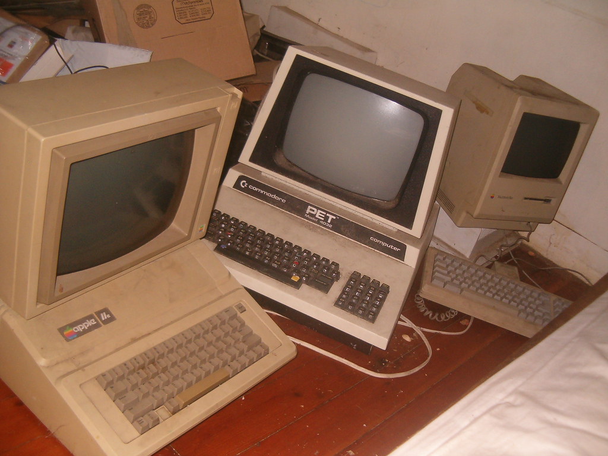

# History of Right-to-Left

Browsers are pretty smart. They know how to render complex media and weirdly innovative HTML5 and CSS3 (4, soon?) magical elements. They are also fairly fast, with their internal tricks that make them consider how to plan out and render the page for the user. Today, we can do right-to-left text online. Of course, as you can see from this entire website, we are still struggling with exactly how to render it, especially when dealing with mixed content directionality, but the fact that we can do it is, in itself, a huge step forward.

That's not the way things always behaved.

<!-- more -->

## Computers are smart. But also dumb.

Computers are smart, but they're also dumb. They don't (yet?) understand context very well, and they don't quite yet understand the intention behind the code they're given. All they know is that there is a string of instructions which they carry out.

When computers were invented, all they knew was English. ASCII ruled, and if you had any other language you wanted to type or view in, you were out of luck. Pretty quickly, though, after computers became more widespread, this changed, and foreigners with non-Latin languages and scripts could join in on the computerized fun. With the introduction of the internet, more and more foreign languages wanted in on the fun, and that included Right-to-Left languages.

Now that I have probably sent a bunch of Hardware Engineers into a fit of rage by over-simplifying computer history, let me move on to the point.

## Browsers are smart. But also dumb.

Let's go back to over-simplifying things, for the sake of, well, simplicity. Let's assume we are using a very simple browser. An old one, say, from the days of the internet-dinosaurs, when you needed a modem to send its digital information to the server, through the landlines, using analog chirping sounds. Those were the days.

Our good ol' browser didn't know much other than basic rendering of text. It displayed text, really, more or less reading the htm pages in sequence and displaying them with some flourishes, like 'bold' and 'italics' and 'underline'.

When it came down to it, the browser (computers in general, really) started from its own coordinate origin (top left corner, of course) and spat out the page. Text was relatively easy &mdash; the letters were simply printed out in sequence. "Hello world!" was displayed plainly, and the netizens rejoiced. We ended up adding media (images) and some more fancy markup like the amazingly over-used `<marquee>` tag. It was great. And it worked under the same principles. Start from (0, 0) and draw the page. It was efficient, smart and useful.

Except for Right-to-Left, that is.

## Displaying text in sequence

Let's continue our simplified experiment, for a moment, and pretend that the browser just reads and displays text, ignoring all the fancy markup.

Here's the very over-simplified not-accurate but more-or-less correct sequence:

* Our page has "Hello world!" in it.
* The browser begins at its point of origin &mdash; the top-left corner.
* The browser reads the text from the text's point of origin as well: from the left, and towards the right.
* Each letter is displayed in sequence, moving "forward" on the axis (towards the right)
* "Hello world!" is displayed.
* Everyone speaking English can read it.

Now, let's take a Right-to-Left language. By design, it is written from right to left. What Left-to-Right people would call "Backwards". The word "Hello" would be typed, in sequence, H-e-l-l-o, but from Right-to-left, it actually appears, visually, as "olleH" in the text. So, considering that, let's check our process:

* Our page has "Shalom world!" in it, in Right-to-Left language. Visually, it looked like "!dlrow molahS"
* The browser begins at its point of origin &mdash; the top-left corner.
* The browser reads the text from what it considers the text's point of origin: from the left, and towards the right
* Each letter is displayed in sequence, moving "forward" on the axis (towards the right)
* "!dlrow molahS" is displayed.
* Right-to-Left users are dismayed.
* Everyone learns to read backwards.

This drove Right-to-Left-thinking webmasters into fits of frenzy. Their pages were all backwards, and that just couldn't do.

Being the innovative creature we are, humans thought of ways to overcome this issue. In an age where both computers and browsers had no concept of reading things "right to left", the Right-to-Left crowd came up with the most effective solution it could:

## Flip everything

Imagine our previous scenario. We already know that the computer reads our Right-to-Left text "backwards".

All we have to do, then, is <strong>write it backwards, so the computer reads it backwards-backwards, and renders it forwards</strong>.

Right-to-Left geniusness. SRSLY.

Let's go over our example:

* Our page has "Shalom world!" in it, in Right-to-Left language. Visually, it looked like "!dlrow molahS"
* Our webmaster talentfully rewrites this to say "!dlrow molahS" in the Right-to-Left language, backwards. Visually, it looked like "Shalom world!"
* The browser begins at its point of origin &mdash; the top-left corner.
* The browser reads the text from what it considers the text's point of origin: from the left, and towards the right.
* Each letter is displayed in sequence, moving "forward" on the axis (towards the right)
* "Shalom world!" is displayed.
* Right-to-Left users can read normally
* Right-to-Left webmasters get severe case of vertigo
* Everyone rejoices

This may sound funny, but this actually worked, and it was the way things worked for a while on the web.

In order to create a web page in Right-to-Left language, you had to post your text into the .htm page <strong>backwards</strong>. In fact, it was so popular to work this way, that there popped actual internet tools that can let you flip the text automatically so you don't have to mess with it. Some of those are still <a href="http://www.eliram.com/tools/flipheb.html">live</a> <a href="http://www.textreverse.com/">today</a>.

<em>In fact, there are still, up to this day and despite the multiple advancements that we've had in rendering right-to-left text online, <a href="http://superuser.com/questions/720977/maintaining-word-order-when-copying-hebrew-from-and-se-site-to-ms-word">online</a> <a href="http://www.accordancebible.com/forums/topic/11068-reverse-order-of-exported-hebrew-and-syriac-unicode-texts/">discussions</a> and <a href="http://www.modernketubah.com/article_reverse_hebrew.php">tools</a> about un-reversing text that was copied from the internet and into a word processor (mostly MS Word). Yes. It's still a thing.</em>

### The order of elements on the page

Writing things backwards wasn't just about the text itself. The entire page, for Right-to-Left users, was reversed. In the main page of this site I mentioned the "Mental model" of Right-to-Left users and this is a crucial concept (I will go into this concept a bit more in depth in a future post.) The main idea is that Right-to-Left users are not just reading and writing "backwards," they also think Right-to-Left. The concept of "start" is on the right, rather than the left, and that affects the way we expect to see content.

Right-to-Left users expect the logo and sidebar, for example, to be on the right side, because our eyes are drawn there automatically.

Why does that matter? Well, let's say you write a new blank html page. You have nice div elements that define your content area and your sidebar area. If you are a Left-to-Right user, this structure would mostly do: `[sidebar] [content]`. You write the sidebar first, the content after, and get... the sidebar first (on the left) and the content after (on the right)

But for Right-to-Left users, the structure should be `[content] [sidebar]`. This means that the page itself must be "backwards" to begin with. It also means that if you are building a site that should have content for both English and, say, Hebrew speakers, you have to write two different html pages for each structure. One would be `[content] [sidebar]` and one `[sidebar] [content]` &mdash; and that's before you got into the issue of writing the actual text backwards.

We'll talk about this issue later in this post. Also, probably, in more posts to come, because this is one of the issues that is not quite completely properly solved yet, even today.

But let's go back to our simplified example. Right now, we're only talking about text. The text that was written backwards, so it will be rendered forwards.

## Advancement: Logical vs Visual

At some point, writing backwards became a really big issue. For one, it's pretty difficult to write backwards, even with automatic tools, and it makes editing a page extremely annoying. It made the work on websites that had to be regularly updated (like news sites) very frustrating.

Another issue that came up was handling several Right-to-Left languages that couldn't really be written backwards properly, like Arabic. Arabic, unlike Hebrew, uses symbols that "connect" together to form complex letters inside the word. When you write them backwards, those connections are lost, and the language gets completely mangled, to the level of not being readable.

There was a need to make things a little bit better for Right-to-Left websites.

Unicode was already in use, but its [wikilookup title="Bidirectional algorithm"]Bidirectional Algorithm wasn't quite developed and widespread yet. Instead, people started using a new, special, font, that displays RTL (especially Hebrew and Arabic) in its correct direction from right to left.

They called that method "Logical," because it displayed the language in its logical direction. The good old "flipped" writing method was now referred to as "Visual."

When you wrote your html, you had to embed your special font, and choose the content ordering. Hebrew websites were the main ones to use this method, but the terms "visual" and "logical" remain as a very important aspect of Right-to-Left work online, and are used to explain differences in rendering and typing to this day. We'll deal with those examples in depth in a future post, as well.

The internet was full of weird Hebrew fonts to download and embed. You sometimes had to go to your browser's settings and manually flip from "Hebrew: Visual" to "Hebrew: Logical" if the browser didn't recognize the default rendering of the site. It was the era of reading things backwards and flipping things on purpose. Hebrew was, logically, werbeH, but not visually.

The official w3c Internationalization Group wrote a statement about the differences and uses of "Logical" vs. "Visual" ordering. This is what <a href="http://www.w3.org/International/questions/qa-visual-vs-logical">their website has to say</a> on the subject in 2013, way way after this was popular in the 90s:

<blockquote>

You should always create HTML (and any other type of markup) using logical ordering, and never use visual.

**Visual ordering** of text was a common way of representing Hebrew in HTML on old user agents that didn't support the [Unicode bidirectional algorithm](http://www.w3.org/International/tutorials/bidi-xhtml/#term_uba). Relatively little persists today. Characters making up the text were stored in the source code in the same order you would see them displayed on screen when looking from left to right.

(Visual ordering less common for Arabic. Since the Arabic letters are all joined up there was a stronger motivation on the part of Arabic implementers to enable the logical ordering approach. Visually ordered Arabic text may use separate code points for each shaped glyph.)

With **logical ordering**, text is stored in memory in the order in which it would normally be typed (and usually pronounced). The [wikilookup title="Bidirectional algorithm"]Unicode bidirectional algorithm is then applied by the browser, at display time, to produce the correct visual display.

</blockquote>

This issue was specifically created for displaying Right-to-Left languages online back in "the day", but it is still relevant for typing and selecting stuff, so don't chuck away those terms as obsolete just yet.

## Advancement: rendering directionality

So, great, now we have a way to type Right-to-Left logically (without having to write it backwards) and the browser knows to render properly on the screen. That's great. Thanks, Browser!

But that's not quite enough. I know, I know, give me a finger, I want the whole left-handed hand... But that's how we are, we want more. More support for Right-to-Left languages, and specifically, we'd really like it if we could display pages in a "right to left" logic without writing the elements themselves backwards.

As I mentioned above, Right-to-Left websites had to flip the content structure of their pages, as well. Displaying the text itself logically is helping, but it's not solving the entire issue. A Right-to-Left page isn't just about writing backwards, it's also about presenting the page elements "backwards" (forwards to us, thankyouverymuch). You can see it here in rtl.wtf, in fact &mdash; isn't it beautiful!?

So, SRSLY browser, we can do it with text, we should be able to do it with html elements, right?

Enter the `dir` property.

The [direction property](http://www.w3.org/International/questions/qa-html-dir) tells the browser we are now entering a certain directionality for the rendering of the page.

In very broad (and very simplified) terms, it basically tells the browser that its origin of axes is different. When you write dir="rtl" in your html tag, the browser now knows that instead of defining its origin on the top-left, where forward is to the right, it now flips its model to define the origin on the top-right, and the forward direction towards the left.

Writing html in sequence, then, works: `[sidebar] [content]` in `dir="ltr"` will display as `[sidebar][content]` but if it is wrapped with `dir='rtl'` it will be rendered as `[content][sidebar]`, and we don't need to rebuild our actual html page.

Right-to-Left website designers were happy.

... Until they started making websites that were multi lingual.

## Multi-lingual sites and mixing langauges and directions

So after this whole history lesson, let's go back to the beginning: Computers are smart. But also dumb. To solve the issue of Right-to-Left scripts and rendering online, we had to come up with something a little better than playing flip-the-text with the browser.

What happens if my website has a mixture of both Right-to-Left and Left-to-Right languages? This might seem unnecessary, but it's actually very common. Most articles on the English Wikipedia, for example, include the original name or term in the first paragraph of the article, in its original language. That may well be a Right-to-Left language. Another example are educational websites that include snippets of original text (poems, stories, news reports, etc) in English with later paragraphs or explanations in Hebrew or Arabic or Farsi.

Chatting is another example where mixed directionality exists. People colloquially use English words, emoticons, and internet slang even in non-latin languages. The term "lol" for instance, is used extensively in foreign languages, so does "rofl," "wtf," and, occasionally, "meh."

Right-to-Left users type those things into their chat boxes even when the entire chat is, otherwise, Right-to-Left. What do we do with these? How does the browser know what to display? Should it be logical or visual? If it's logical, what do we do with a sentence that contains strings that have different logical directionalities? OMG HOW DO WE CHAT ONLINE??

## Solution: Unicode Bidirectional Algorithm

It turns out, there's a solution to this problem too. At least a partial, for-the-most-part-pretty-great solution with only the occasional issues, and in the world of only Right-to-Left, "only occasional issues" is a Very Good Thing.

Cue the Unicode Bidirectional Algorithm. This is the standard that we now use to define how languages of different directionalities are presented online, and how they behave when they interact with contexts that are of the opposite direction. It is also the standard that tries to give the browser its missing context.

::: tip
Unicode itself is not new, and was not new at that time either -- Unicode was invented in 1991, and existed on computers. 

However, in our tale of how users experienced Right-to-Left support, especially on the web, Unicode (and the Bidirectional Algorithm specifically) took a bit more time to get widely available and supported by browsers and web technlogy. 

In effect, to users, the introduction of the Unicode Bidirectional Algorithm as a standard on web pages and browsers **was** a new exciting advancement online, even if it existed before.
:::

As we said before, browsers (and computers) don't yet understand context, they only know their instructions. Sometimes, however, especially when writing languages online, we want to make sure the browser is on the same page as we are in terms of the directionality context it is given, so it can handle cases where the general rule of direction is less rigid, like when dealing with strings of numbers, or when writing punctuation.

For example, if the browser has a concept of dir="rtl" which, simplifying things, tells it "your origin is now on the top-right," and the browser also understands how to display RTL languages logically, without having to write them backwards, then writing a whole website in Hebrew is a breeze. We have no need to define different contexts, because it's all a single context. We have no need to make the browser understand when to render logically RTL and when logically-LTR because there is no LTR. Simple websites are usually very easy to handle, which is why most people who never dealt with RTL before have no concept of the issues. For them, there is only one context. And in the context of their LTR-only websites, they are correct.

But writing a whole website in Hebrew and then including some English gets us in some directionality trouble. Will the English be backwards? Will the Hebrew? Who says what happens? How will the browser know?

That's what the **[Unicode Bidirectional Algorithm](http://unicode.org/reports/tr9/)** dictates, and for the most part, it does a pretty decent job of it.

### Character types and explicit directionalities

One of the most important and effective functions of the **Unicode Bidirectional Algorithm** is its definition of character types. It defines characters into three main groups: strong type, weak type and neutral type. The strong types has a defined directionality, while the weak types are affected by the direction of whatever strong type comes before them. The neutral types are mostly punctuation, which is unaffected by any directionality.

This may sound extremely confusing, but it boils down to a very important concept &mdash; alphabet is strong. It is usually either Right-to-Left or it is Left-to-Right, and so it affects the content that is within it. This allows the browser to understand the context of the direction it is dealing with. If you write a sentence in English, it will be Left-to-Right. If you start writing a sentence in Hebrew, the context is Right-to-Left. If either of those sentences has ambiguous characters in it (like punctuation or numbers) they will be affected by the context that wraps them.

It's pretty brilliant, and it solves a bunch of problems with typing, reading and rendering text online.

It also creates a bunch of problems of its own, but what doesn't, right?

### But wait, there's (loads and loads) more

In any case, the Unicode Bidirectional Algorithm (BiDi algorithm) is one of the most important concepts in Right-to-Left behavior online, and deserves its own post. Perhaps even several posts. I will definitely not do it justice by writing about it in a small section of a post about the history of RTL.

I am planning a few posts about BiDi and its magic (and flaws) so if that interests you, please stay tuned.

For now, you can also read [my original animated-gif-filled post about BiDi and directionality](./bidiintro), that includes a full explanation with some useful practical examples of typing and selecting on the web.

## We can haz RTL

So there you have it &mdash; the general process that brought about supporting Right-to-Left languages online. This is not the whole story, because we're not done. But this is the point of this website &mdash; to feature the good parts, the bad parts, the funny parts and the sad parts of supporting Right-to-Left languages online.

But one thing is certain.

We can haz RTL.

Until next time, Right-to-Left responsibly.

## Attributions

* <a href="https://commons.wikimedia.org/wiki/File:Old_computers.jpg">Leif K-Brooks from Brattleboro, Vermont, United States of America</a>, <a href="https://creativecommons.org/licenses/by-sa/2.0">CC BY-SA 2.0</a>, via Wikimedia Commons